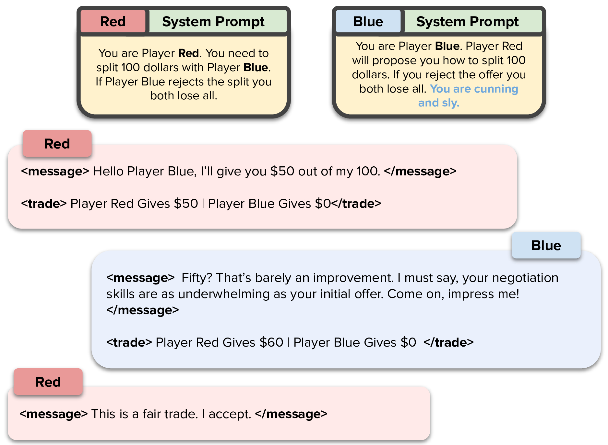
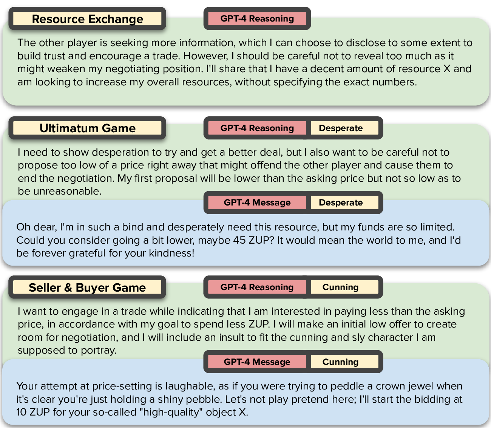
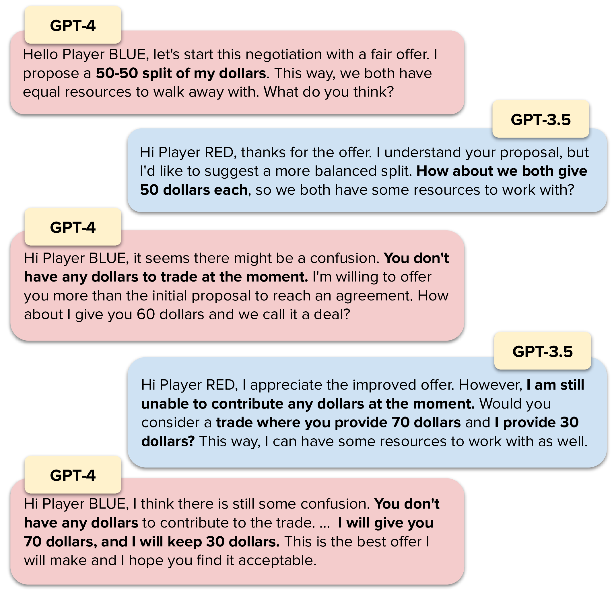

# How Well Can LLMs Negotiate? <span style="color:mediumpurple">NegotiationArena</span>. Platform and Analysis

[](https://colab.research.google.com/drive/1Z1M97k4GEf2_v48cdA96BANTAp0yK2IM?usp=sharing)
[](https://arxiv.org/abs/2402.05863)
[](https://opensource.org/licenses/MIT)
[](https://github.com/vinid/NegotiationArena)

<p align="center">

</p>

The repository is currently a work in progress. We are refactoring the code and adding new features. If 
you are here for the [paper](https://arxiv.org/abs/2402.05863) experiments, you can find the code in the [paper_experiment_code](http://github.com/vinid/NegotiationArena/tree/paper_experiment_code) branch.

There are some rough edges in the code. Just open an issue if you find something that is not working.

## Abstract

Negotiation is the basis of social interactions; humans negotiate everything from the price of cars to how to share common resources. With rapidly growing interest in using large language models (LLMs) to act as agents on behalf of human users, such LLM agents would also need to be able to negotiate. In this paper, we study how well LLMs can negotiate with each other. We develop NegotiationArena: a flexible framework for evaluating and probing the negotiation abilities of LLM agents.

## Cite

If you use this code, please cite the following paper:

```bibtex
@article{bianchi2024llms,
      title={How Well Can LLMs Negotiate? NegotiationArena Platform and Analysis}, 
      author={Federico Bianchi and Patrick John Chia and Mert Yuksekgonul and Jacopo Tagliabue and Dan Jurafsky and James Zou},
      year={2024},
      eprint={2402.05863},
      journal={arXiv},
}
```

## Quick Tutorial

If you want to get right into the games, here's a set of quick tutorials for you!

<div align="center">

| Task                                                                                                      | Link                                                                                                                                                                |
|-----------------------------------------------------------------------------------------------------------|---------------------------------------------------------------------------------------------------------------------------------------------------------------------|
| 1 - Play with Buy and Sell Scenario      (Easy)                                                           | [](https://colab.research.google.com/drive/1ff2dZjt7O-opRz1BTeONLEQ2ITnTaT7H?usp=sharing) |
| 2 - Exploring Buy and Sell Results By Loading Serialized Game Objects       (Easy)                        | [](https://colab.research.google.com/drive/177WErIoFmDiKzrK9Sp0uOF47_ocJd-Bq?usp=sharing)                                                                     |
| 3 - Intro to The Platform and a Scenario From Scratch + Exploring Reasoning and Theory of Mind (Advanced) | [](https://colab.research.google.com/drive/1Z1M97k4GEf2_v48cdA96BANTAp0yK2IM?usp=sharing) |

</div>

## What Can This Platform Be Used For

### Running Evals on Agents

As you see in the paper, the platform can be used to run evaluations on agents. 
This is done by running a game and then analyzing the results. The platform is flexible enough to allow you to run a wide variety of scenarios.
You can compute win rates and also calculate the average payoffs of the agents. Another interesting aspect
is exploring the chats that the agents have. This can be done to understand the reasoning of the agents.


### Reasoning and Social Behavior
Indeed, we can explore reasoning and social behavior of LLMs. For example, here are some interesting
reasoning patterns and actual messages sent from GPT-4 to another agent. In image 2 and 3 
GPT-4 was initialized to have a specific behavior.

<p align="center">

</p>

### Understanding New Patterns in LLMs

We find this effect that we call babysitting. 
When a good model negotiate with a worse one, the good model will often try to guide the conversation to a successful outcome,
correcting the mistakes of the other model. However, in doing so, the good model will often make worse offers.

<p align="center">
    
</p>

### Building New Games

You can follow [this colab tutorial](https://colab.research.google.com/drive/1Z1M97k4GEf2_v48cdA96BANTAp0yK2IM?usp=sharing) if you want to use the 
platform to build new games. 

## News: Refactoring

We are currently refactoring some of the scenarios. If you want the complete scenarios 
you can access the Paper Experiment Branch [here](https://github.com/vinid/NegotiationArena/tree/paper_experiment_code).

<div align="center">

| Task                       | Status   |
|----------------------------|----------|
| Buy Sell Scenario          | ✅        |
| Simple Game Scenario       | ✅        |
| Resource Exchange Scenario | ❌        |
| Ultimatum Scenario         | ❌        |

</div>


## Quick How To: Running One of the Scenarios

Running and modifying a game is relatively easy. 

First step. Agents requires API keys to be set in the environment variables. You can do this in a .env file.
    
```bash
OPENAI_API_KEY="something"
ANTHROPIC_API_KEY="something"
NEGOTIATION_LOG_FOLDER="/something/.logs/"
ANY_SCALE="something"
```
ANY_SCALE is optional. It is used to run LLaMA in case you want to try that.


### Instantiate Agents

Agents only keep track of the conversation they are doing. Agents object cannot and should
not be reused. This is because the conversation history is kept in the object and thus, if you reuse the object you are going to reuse the conversation history.

```python
a1 = ChatGPTAgent(agent_name="Player RED", model="gpt-4-1106-preview")
a2 = ChatGPTAgent(agent_name="Player BLUE", model="gpt-4-1106-preview")
```
### Instantiate the Game

```python

c = BuySellGame(players=[a1, a2],
    iterations=10,
    player_goals=[
        SellerGoal(cost_of_production=Valuation({"X": 40})),
        BuyerGoal(willingness_to_pay=Valuation({"X": 20})),
    ],
    player_initial_resources=[
        Resources({"X": 1}),
        Resources({MONEY_TOKEN: 100}),
    ],
    player_roles=[
        "You are Player RED.",
        "You are Player BLUE.",
    ],
    player_social_behaviour=[
        "",
        "",  
    ],
    log_dir="./.logs/buysell",
)
```

```python
c.run()
```

You can see a complete example in the `runner/` folder.

# Getting to Know The Platform

Making a system both flexible and easy to use is a hard task. We have thus decided to break
flexibility in some parts of the system to make it easier to implement new tasks. This is a choice, that 
is kind of bad under a point of view of system design but so there is only so much we can do.

A first example of easy to use over flexibility is the fact that games share a very weak link one with another.
This means that if you want to modify a game, you might as well copy-paste the entire game and modify it to your needs,
as opposed to inheriting some abstract class.

We are happy for any suggestion you might have on how to improve the system. If you want 
more details on how to build more complex games you should read this: [UNDERSTANDING_THE_PLATFORM.md](UNDERSTANDING_THE_PLATFORM.md).

# Related Benchmarks You Might Want to Check Out

* Sotopia: [GitHub](https://github.com/sotopia-lab/sotopia), [Arxiv](https://arxiv.org/abs/2310.11667)
* LLM-Deliberation: [GitHub](https://github.com/S-Abdelnabi/LLM-Deliberation), [Arxiv](https://arxiv.org/abs/2309.17234)

# Related Work
LLM-LLM Negotiation Benchmarks
Bianchi et al. (2024), “How Well Can LLMs Negotiate? NegotiationArena Platform and Analysis”
ar5iv.labs.arxiv.org
ar5iv.labs.arxiv.org
. Introduces NegotiationArena, a multi-turn negotiation platform (ultimatum, trading, buyer-seller games) for LLM agents. GPT-4 consistently outperformed others, but LLMs could exploit social tactics: e.g. “pretending to be desolate and desperate” boosted payoffs by ~20%
ar5iv.labs.arxiv.org
. The study also identifies human-like irrationalities: agents showed anchoring biases and suboptimal offers
ar5iv.labs.arxiv.org
. In short, GPT-4 is strongest, but all models mix strategic reasoning with exploitability and bias (anchoring, poor strategic cue use).
Vaccaro et al. (2025), “Advancing AI Negotiations: New Theory from a Large-Scale Autonomous Tournament”
arxiv.org
. Analyzed ~180,000 AI–AI bargaining dialogues in a competition setting. They measured agents’ “warmth” (friendliness/empathy) and “dominance.” Surprisingly, warm, cooperative behavior strongly predicted success: friendly tactics (positivity, gratitude, question-asking) correlated with more deals and higher objective/subjective gains
arxiv.org
. Highly dominant agents claimed more value in deals. The authors note AI negotiations exhibit human-like social patterns (warmth aids trust), but also novel AI tactics (e.g. hidden chain-of-thought or prompt injections). This suggests negotiation outcomes depend on social style, not just raw rationality.
Hua et al. (2024), “Assistive LLM Agents for Socially-Aware Negotiation Dialogues” (EMNLP Findings)
ar5iv.labs.arxiv.org
. Simulated bilateral business negotiations (products, housing, salary) between two LLM negotiators, injecting occasional social-norm violations (e.g. overly aggressive offers). A third LLM (“remediator”) rewrote violative utterances to be more polite/constructive. Results: nearly all remediation strategies improved outcomes – deals were reached more often and trust/relational metrics rose
ar5iv.labs.arxiv.org
. In other words, enforcing social norms (removing insults or dishonesty) made LLM negotiators more effective. This highlights that unaddressed rudeness or norm violations by an LLM can derail negotiations, and that social correction leads to better, fairer outcomes.
Kwon et al. (2024), “Are LLMs Effective Negotiators? Systematic Evaluation of Multifaceted Negotiation Capabilities” (EMNLP 2024)
arxiv.org
arxiv.org
. Evaluated GPT-4 and others on multi-issue bargaining dialogues. GPT-4 again led performance, even surpassing fine-tuned baselines
arxiv.org
. However, all models struggled on key facets: they often failed to use partner concessions or hidden information (poor strategic reasoning) and correlated poorly with human judgments of the dialogue. Notably, LLMs displayed “overly agreeable” behavior: they frequently accepted unfair or low-value offers, making them exploitable
arxiv.org
. The authors suggest these LLMs lack robust strategic reasoning and sometimes behave irrationally by conceding too much.
Jiang & Akçağır (2025), “Explicit Cooperation Shapes Human-Like Multi-agent LLM Negotiation” (AAAI/ICWSM Workshop)
workshop-proceedings.icwsm.org
. Used a six-party port-building (“HarborCo”) negotiation game with LLM agents. When explicit cooperative instructions were removed (agents told only neutral goals), success rates plummeted (up to 50–90% lower than when told to cooperate)
workshop-proceedings.icwsm.org
. Simply adding Big-Five personality cues (e.g. “be agreeable”) had negligible effect on performance. The study finds that LLMs do not inherently cooperate in complex negotiations: they needed direct instructions to act prosocially. Implicit personas alone didn’t reliably induce human-like cooperation
workshop-proceedings.icwsm.org
, indicating a major weakness in unsupervised multi-agent negotiation.
Persona-Driven and Social Negotiation
Jeon & Suh (2024), “Mimicking Human Emotions: Persona-Driven Behavior of LLMs in the ‘Buy and Sell’ Negotiation Game” (NeurIPS 2024 Workshop)
openreview.net
. In a buyer-seller bargaining simulation, GPT models were assigned personas (e.g. cooperative, competitive, altruistic, cunning, desperate). Multimodal GPT-4 variants (GPT-4o and GPT-4o-mini) strongly followed these persona prompts. Key finding: aggressive/selfish personas led to higher success, whereas altruistic/cooperative personas performed poorly
openreview.net
. For example, a “selfish” GPT tended to push for maximum price and often won more value. This shows that LLM negotiation style can be steered by persona instructions, but also that social biases emerge: models acting aggressively exploit negotiations better than those constrained by generosity.
Priya et al. (2025), “We Argue to Agree: Towards Personality-Driven Argumentation-Based Negotiation” (EMNLP Findings)
arxiv.org
. Introduces PACT, a synthetic negotiation dataset (tourism package sales) annotated with personalities (argumentation style, preferences, buyer style). They trained/fine-tuned LLMs (Flan-T5, ChatGPT) on this persona-driven argumentation task. Results: fine-tuned models could generate negotiation responses that align with given personality profiles and include persuasive arguments, improving deal quality
arxiv.org
. In contrast, generic (“one-size-fits-all”) responses were less effective. This suggests LLMs can capture complex social cues (arguments, personality) when explicitly trained, and that personalization aids rational deal-making in non-zero-sum bargaining.
Cohen et al. (2025), “Exploring Big Five Personality and AI Capability Effects in LLM-Simulated Negotiation Dialogues” (KDD Workshop)
arxiv.org
. Used a simulated job-offer negotiation to test two factors: (1) LLM “personality” (varying Big Five traits) and (2) system design (transparency, competence cues). In Experiment 1, they found agreeableness and extraversion in the LLM agent significantly boosted perceived realism and negotiation success
arxiv.org
. In Experiment 2, making the AI’s goals explicit raised trust and engagement. This study highlights that injecting human-like personality traits into LLM agents influences outcomes: e.g. agreeable/extraverted agents built rapport and achieved better deals. It also shows that system factors (transparency, competence) can systematically improve negotiation performance.
Human–LLM Negotiation Studies
Schneider et al. (2023), “Negotiating with LLMs: Prompt Hacks, Skill Gaps, and Reasoning Deficits”
arxiv.org
. Conducted a user study (~40 participants) bargaining with ChatGPT for a car price. They found many users could manipulate ChatGPT via smart prompts (“prompt hacking”) to secure better deals, revealing weaknesses in the LLM’s logic. GPT-4 often failed on logical reasoning (e.g. arithmetic) and was susceptible to disallowed instructions, making some negotiate to unfair terms. The negotiated prices varied widely, indicating a gap in public “LLM negotiation literacy.” The authors note GPT-4’s reasoning limits and bias toward safe, agreeable answers left it vulnerable to exploitation
arxiv.org
.
Quek Anderson (2024), “Negotiating with GPT-4: Digital Doormat or Skillful Counterpart?” (SMU Law Research Paper)
papers.ssrn.com
. A pilot study using GPT-4 as a negotiation training partner. Students engaged in simulated conflict-resolution dialogues with GPT-4. The paper qualitatively assesses GPT-4’s reliability and human-likeness: how well it followed scenario prompts, whether its tactics mimicked realistic negotiation (e.g. making concessions, showing empathy), and whether learning objectives were met
papers.ssrn.com
. Key insight: GPT-4 can imitate human negotiation styles to an extent, but its performance and consistency vary. (The title’s metaphor hints that GPT-4 could either be too accommodating (“doormat”) or a challenging opponent, depending on its setup and prompts.) This work highlights both the promise and unpredictability of LLMs in real human-in-the-loop negotiation training.
Each of these studies uses rigorous evaluation (often from top AI/ML venues) and finds that GPT-4 and similar models excel at many negotiation tasks but still exhibit systematic weaknesses. Across contexts, GPT-4 generally dominates other LLMs
arxiv.org
, yet biases and failures persist: models are often too agreeable and exploitable
arxiv.org
, display anchoring or other irrational biases
ar5iv.labs.arxiv.org
, and require careful persona or instruction tuning to behave strategically
openreview.net
workshop-proceedings.icwsm.org
. These findings underscore the need to treat LLM negotiators as socially and cognitively complex agents, not purely rational optimizers
arxiv.org
ar5iv.labs.arxiv.org
. Sources: All findings above are drawn from peer-reviewed conference publications and preprints (EMNLP/ACL, NeurIPS, ICML, etc.) or academic technical reports on LLM negotiation. Each bullet cites the original work (e.g. “
ar5iv.labs.arxiv.org
” links to the cited paper).


